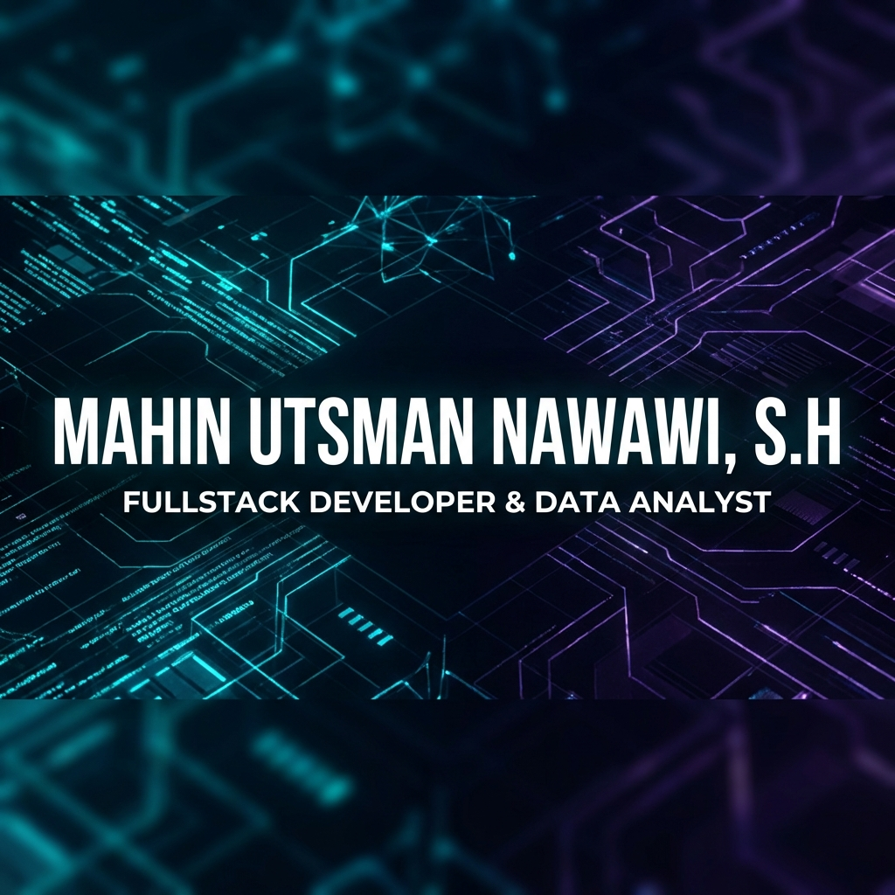

    

 

# Hi there, I'm Mahin Utsman Nawawi (Pak Hakim) 👋

### Fullstack Developer & Data Analyst from Bandung, Indonesia 🇮🇩

*"Fullstack Precision, Data-Driven Decisions."*

 

## 🚀 About Me

I am a passionate Fullstack Developer and Data Analyst based in Bandung. I specialize in building robust web and mobile applications using modern frameworks like Laravel, Flutter, and Tauri. My goal is to transform complex data into elegant, user-centric digital solutions.

- 🔭 I’m currently working on **Santrix Ecosystem** (SaaS for Santri Management).
- 🌱 I’m currently learning **Advanced Rust & Machine Learning**.
- 💬 Ask me about **Laravel, Flutter, System Architecture, and Data Analysis**.

 

## 🛠️ Tech Stack

| Core | Frameworks | Tools |
|:----:|:----------:|:-----:|
|       |       |       |

 

## 📊 GitHub Stats

  
   
  

 

## 🌟 Featured Projects

### [Santrix Ecosystem](https://github.com/velora-1d/santrix-web)
Comprehensive SaaS for Islamic Boarding School management.
| [Web (Laravel)](https://github.com/velora-1d/santrix-web) | [Desktop (Tauri)](https://github.com/velora-1d/santrix-desktop) | [Mobile (Flutter)](https://github.com/velora-1d/santrix-mobile) |
|:---:|:---:|:---:|
| 🌐 Admin Panel | 🖥️ Management App | 📱 Guardian App |

### [Dashboard Riyadlul Huda](https://github.com/velora-1d/dashboard-rh-web)
Custom dashboard solutions.
- **Web**: [velora-1d/dashboard-rh-web](https://github.com/velora-1d/dashboard-rh-web)
- **Desktop**: [velora-1d/dashboard-rh-desktop](https://github.com/velora-1d/dashboard-rh-desktop)

### [ISP Jabbar](https://github.com/velora-1d/ISP-Jabbar23)
ISP Management System built with Laravel. Manage customers, billing, and tickets efficiently.

 
 

  

 
